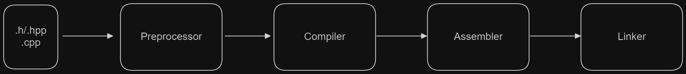
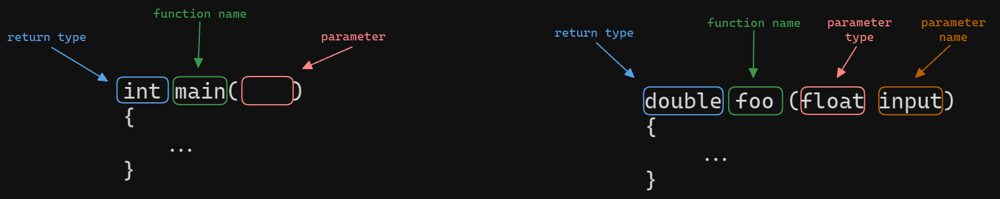

- What are header and source files? Why do we need header files? (#include directive)
- What are namespaces/variables/functions/classes/structs (very basic overview).
- What are scopes/references/pointers (very basic overview).
- How to use templates (i.e. specializations of STL containers).
- Loop syntax (while, for, foreach).
- Basic memory management (new & delete - very basic overview).
- What is compiling, linking and executing? Overview of what happens to the code.
- Common errors encountered in compiling and linking (basic things to try to solve them).
- Using Visual Studio (building projects, debugging, breakpoints and stepping).
- Git basics.

___

### What is C++? 

- What is C++?
- How is it different to Python and C#?

C++ is a compiled programming language unlike **Interpreted languages** like Python or
**JIT languages** like C#, C++ compiles directly to machine code. Machine code is what gets executed by the processor itself.
>Examples interpreted language executables:   
>Python - %localappdata%\Programs\Python\Python312  
>C# - C:\Program Files\dotnet

### What is Compilation?



> MSVC compiles directly to machine code, so assembler is skipped.

Compilation is the process of turning source code into machine code. Compilation happens in stages outlined in the diagram above.
The compilation pipeline consists of **Preprocessing**, **Compilation**, ***Assembly*** and **Linking**.

**Preprocessor** expands preprocessing directives and macros.  
**Compiler** compiles preprocessed code into machine code objects (or assembly files).  
***Assembler*** translates assembly files into machine code objects.  
**Linker** links machine code objects together to produce binaries (executable machine code files).

### Hello world

Here is the most basic C++ program:

```c++
#include <iostream>

int main()
{
    std::cout << "Hello world!" << std::endl;
}
```
`#include` is a preprocessor directive telling the Preprocessor to include something (`iostream`file in this case).

`int main()` is a function declaration, declaring a function called main, that takes no parameters and returns an integer.


`std::` references a namespace called `std`. Namespaces are a way of avoiding naming conflicts.

```c++
namespace mynamespace
{
    //your code here
}

```

### Variables

Variables are objects. They can be of any type: POD, custom classes and even functions.


Make sure to initialise your variables after you declare them, otherwise you may have unexpected behaviour!

It is important to remember RAII (Resource allocation is initialisation).

### Loops

Loops allow you to execute expressions until some condition is reached. 


### Functions

Functions allow you to organise the logic of your code in reusable procedures.



### Classes and Structs

Structs and classes allow for organisation of data.


### Pointers

Here is the mental model of memory you should have:


This is the syntax for pointers:


